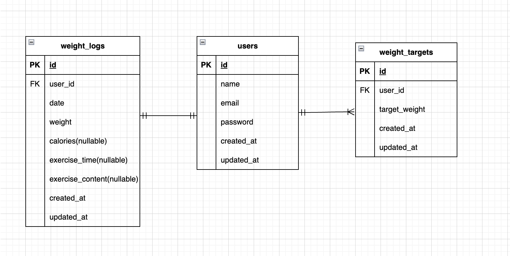

# Pigry

体重管理アプリ（確認テスト用）

ユーザー登録・ログイン後に、
初期体重・目標体重を登録し、体重ログを一覧表示できます。

---

## 使用技術

- PHP 8.1
- Laravel 10
- MySQL
- Docker
- Laravel Fortify（認証）

---
## 主な機能

- ユーザー登録（2ステップ）
- ログイン / ログアウト
- 目標体重の登録
- 初期体重の登録
- 体重ログ一覧表示（ログインユーザーのみ）

---

## 環境構築

```bash
git clone https://github.com/chiisan-2025/pigry.git
cd pigry
docker compose up -d
php artisan migrate:fresh --seed
```
---
## ER図

